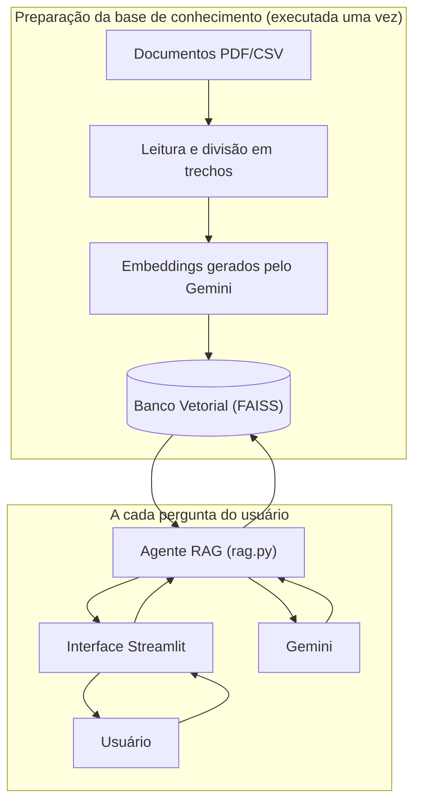
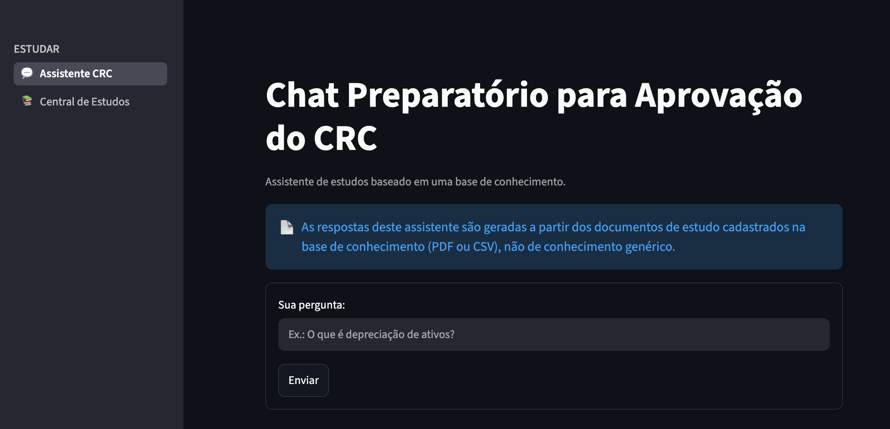
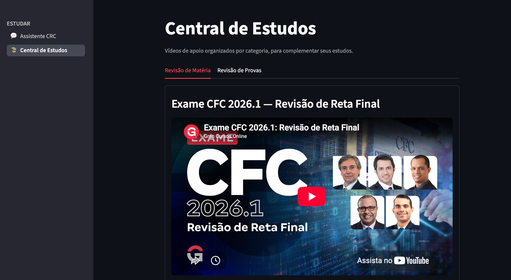
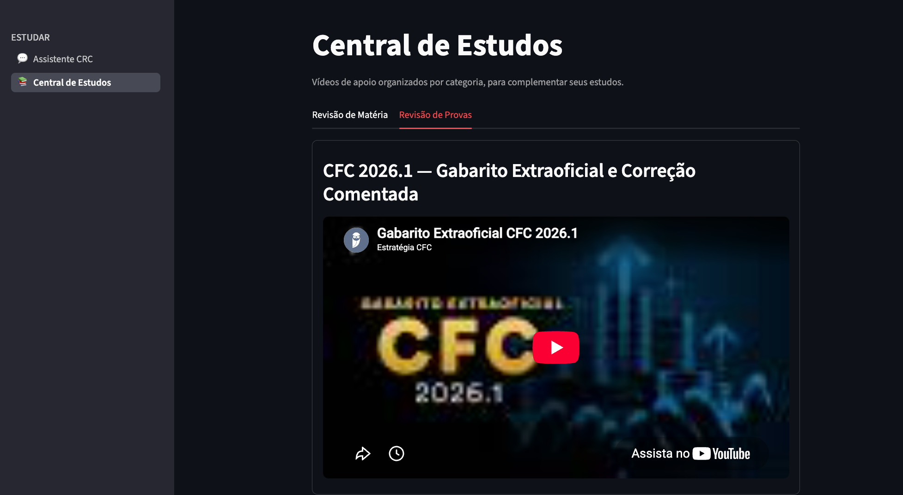

# 🥇 Chat Preparatório para Aprovação do CRC

Agente de inteligência artificial desenvolvido para o **Challenge Alura Agente**, do
programa **ONE — AI for Tech**.

## 💡 Sobre o Projeto

O Chat Preparatório para Aprovação do CRC é um assistente de estudos que responde
perguntas sobre o conteúdo do **Exame de Suficiência do Conselho Federal de
Contabilidade (CRC)**, usando exclusivamente uma base de documentos de estudo (PDF e
CSV) como fonte de conhecimento — não o conhecimento genérico do modelo de IA.

## ❓ Problema

Quem estuda para o Exame de Suficiência do CRC costuma ter vários materiais de estudo
espalhados (apostilas, resumos, provas comentadas) e precisa ler tudo manualmente para
tirar uma dúvida pontual. Não há uma forma rápida de "perguntar" diretamente ao
conteúdo desses materiais e obter uma resposta confiável, sem risco de o assistente
inventar informações que não estão nos documentos.

## 🎯 Objetivo

Criar um agente de IA capaz de responder perguntas sobre os materiais de estudo do CRC,
usando a técnica de **RAG (Retrieval-Augmented Generation)**: buscar os trechos mais
relevantes nos documentos e usá-los como base para a resposta do modelo de linguagem,
deixando claro quando a informação não estiver disponível na base.

## ⚡ Como Funciona

1. Os documentos de estudo (PDF/CSV) ficam em `data/documentos/`.
2. Na primeira execução, cada documento é lido e dividido em trechos menores
   ("chunks"), que são transformados em vetores numéricos (embeddings) pelo Gemini e
   guardados em um índice vetorial local (FAISS).
3. Quando a usuária faz uma pergunta, o sistema busca no índice os trechos mais
   parecidos com a pergunta.
4. Esses trechos (e só eles) são enviados ao Gemini, junto com instruções do "tutor"
   pedindo para responder somente com base neles e avisar quando não houver informação
   suficiente.
5. A resposta é exibida na interface, junto com os nomes dos arquivos usados como
   fonte.

Além do chat, a aplicação tem uma segunda página, **"Central de Estudos"**, acessível
pelo menu lateral. Ela reúne vídeos de apoio do YouTube, organizados em abas por
categoria (Revisão de Matéria e Revisão de Provas), lidos de
`data/videos.json`. É um conteúdo complementar, independente do pipeline RAG.

## 🏛️  Arquitetura da Solução



O fluxo funciona em duas etapas:

- Os documentos PDF/CSV de `data/documentos/` são lidos e divididos em trechos
  menores (`leitor_pdf.py`, `leitor_csv.py`, `indexador.py`).
- Esses trechos são transformados em embeddings pelo Gemini e guardados no banco
  vetorial FAISS (`embeddings_gemini.py`) — isso acontece uma única vez, não a cada
  pergunta.
- Quando a usuária envia uma pergunta pela interface Streamlit (`app.py`), o agente
  RAG (`rag.py`) recebe a pergunta e coordena o processo.
- O agente busca no banco vetorial os trechos mais relacionados à pergunta.
- Esses trechos são usados como contexto: o tutor (`tutor.py`) monta o prompt com as
  regras de não inventar respostas, e o Gemini (`gemini_client.py`) gera a resposta
  final com base neles.
- A resposta, junto com as fontes usadas, retorna para a usuária pela interface.

## 📚 Base de Conhecimento

A base de conhecimento fica em `data/documentos/` e contém:

- `Apostila-Preparatoria-Exame-Suficiencia.pdf` — apostila preparatória para o Exame de Suficiência do CFC
- `Aulão - Intermediaria III - Programa de Revisão FMU.pdf` — material de revisão de Contabilidade Intermediária III
- `Resumo-Contabilidade-Geral.pdf` — resumo de Contabilidade Geral
- `prova_cfc20252_tipo01_comentada_parte 2.pdf` — prova comentada do Exame de Suficiência (Edital nº 02/2025)
- `exemplo_topicos_crc.csv` — CSV de exemplo, criado para este projeto, para demonstrar o suporte a arquivos CSV além de PDF

## 📂 Tecnologias Utilizadas

- **Python** — linguagem principal do projeto
- **LangChain** (`langchain-core`, `langchain-text-splitters`, `langchain-community`) — divisão de texto em trechos e integração com o índice vetorial
- **pypdf** — leitura e extração de texto de arquivos PDF
- **pandas** — leitura de arquivos CSV
- **FAISS** (`faiss-cpu`) — índice vetorial local para busca por similaridade
- **google-genai** — SDK oficial do Google para o Gemini (geração de texto e de embeddings)
- **Streamlit** — interface web do assistente
- **python-dotenv** — carregamento da chave de API a partir do arquivo `.env`
- **pytest** — testes automatizados (instalado via `requirements-dev.txt`, não faz parte da aplicação em produção)

## Estrutura de Pastas

```
chat-crc-challenge/
├── data/
│   ├── documentos/        # PDFs e CSV usados como base de conhecimento
│   ├── indice_vetorial/   # índice FAISS gerado automaticamente (não vai para o Git)
│   └── videos.json        # vídeos de apoio exibidos na página "Central de Estudos"
├── src/
│   ├── leitor_pdf.py          # leitura de PDF (pypdf)
│   ├── leitor_csv.py          # leitura de CSV (pandas)
│   ├── leitor_documentos.py   # identifica automaticamente PDF ou CSV
│   ├── indexador.py           # divide em trechos e cria/carrega o índice FAISS
│   ├── embeddings_gemini.py   # gera embeddings usando o Gemini
│   ├── gemini_client.py       # comunicação simples com o Gemini (pergunta -> resposta)
│   ├── tutor.py                # personalidade/instruções do tutor (separado da lógica de documentos)
│   ├── rag.py                  # pipeline RAG completo (busca + tutor + Gemini)
│   ├── app.py                  # interface Streamlit (página principal: o chat)
│   └── pages/
│       └── 1_📚_Central_de_Estudos.py   # segunda página: vídeos de apoio por categoria
├── tests/                  # testes automatizados (um arquivo por módulo)
├── screenshots/             # evidências do deploy na OCI
├── VALIDACAO.md             # roteiro de validação com perguntas e respostas reais
├── requirements.txt
├── .env.example
└── README.md
```

## 🔑 Pré-requisitos

- Python 3.9 ou superior (evite versões muito novas/beta — neste projeto, o Python
  3.14 não tinha pacotes prontos para uma das dependências e exigia compilação; o
  projeto foi desenvolvido e testado com Python 3.9)
- Uma chave de API do Gemini, gratuita, obtida em
  [aistudio.google.com/apikey](https://aistudio.google.com/apikey)

## 🛠️ Instalação

```bash
# Clonar o repositório
git clone https://github.com/marilene-narciso/chat-preparatorio-crc-alura-agent.git
cd chat-preparatorio-crc-alura-agent

# Criar e ativar um ambiente virtual
python3 -m venv venv
source venv/bin/activate      # Windows: venv\Scripts\activate

# Instalar as dependências
pip install -r requirements.txt
```

`requirements.txt` instala só o necessário para **rodar a aplicação**. Se você quiser
também rodar a suíte de testes automatizados (`pytest`), instale as dependências de
desenvolvimento em vez disso — `requirements-dev.txt` já inclui tudo de
`requirements.txt` mais o `pytest`:

```bash
pip install -r requirements-dev.txt
pytest
```

## ⚙️🔗 Configuração da API

1. Copie o arquivo de exemplo:
   ```bash
   cp .env.example .env
   ```
2. Abra o `.env` e preencha sua chave:
   ```
   GOOGLE_API_KEY=sua_chave_aqui
   GEMINI_MODEL=gemini-flash-latest
   ```
3. O `.env` nunca deve ser enviado ao GitHub — ele já está listado no `.gitignore`.

## 💡⚙️ Como Executar

```bash
# Rodar a interface web
streamlit run src/app.py
```

Isso abre o assistente no navegador (por padrão em `http://localhost:8501`). Na
primeira pergunta feita, o índice vetorial é construído automaticamente a partir dos
documentos em `data/documentos/` (pode levar alguns minutos); nas execuções seguintes,
o índice já fica salvo em `data/indice_vetorial/` e é apenas recarregado.

Também é possível rodar o pipeline pelo terminal, sem interface:

```bash
python -m src.rag
```

## 💡 Exemplos de Perguntas

Perguntas reais testadas contra a base de conhecimento (ver `VALIDACAO.md` para o
roteiro completo):

- "Segundo o material, o total dos débitos sempre deve ser igual ao total dos créditos?"
- "O que é a conta capital social, segundo o resumo de contabilidade geral?"
- "Quantas questões objetivas tem a prova do Exame de Suficiência do Edital nº 02/2025?"
- "Quanto tempo os candidatos têm para realizar essa prova do Exame de Suficiência?"
- "A partir de que ano a IFRS 18 entra em vigor de forma obrigatória?"

## 🗣️ Exemplos de Respostas

Respostas reais geradas pelo sistema (cópia literal, sem edição):

> **Pergunta:** Quantas questões objetivas tem a prova do Exame de Suficiência do Edital nº 02/2025?
>
> **Resposta:** A prova do Exame de Suficiência referente ao Edital nº 02/2025 é composta por **50 (cinquenta) questões objetivas**, cada uma contendo 4 opções de resposta (A, B, C e D), com apenas uma alternativa correta.
>
> **Fontes:** Apostila-Preparatoria-Exame-Suficiencia.pdf, prova_cfc20252_tipo01_comentada_parte 2.pdf

> **Pergunta:** A partir de que ano a IFRS 18 entra em vigor de forma obrigatória?
>
> **Resposta:** A IFRS 18 entra em vigor e passa a ter adoção obrigatória a partir de **2027**.
>
> **Fontes:** Aulão - Intermediaria III - Programa de Revisão FMU.pdf

> **Pergunta:** Qual é a capital da França? *(fora da base de conhecimento)*
>
> **Resposta:** Não encontrei essa informação na base de conhecimento.

## 📝 Testes Realizados

- **Testes automatizados** (`pytest`, pasta `tests/`): um arquivo de teste por módulo
  (`leitor_pdf`, `leitor_csv`, `leitor_documentos`, `indexador`, `tutor`, `gemini_client`,
  `rag`). A maior parte roda offline; os testes que chamam a API real são
  automaticamente pulados se a `GOOGLE_API_KEY` não estiver configurada.
- **Validação de ponta a ponta** (`VALIDACAO.md`): 7 perguntas reais executadas contra
  o pipeline completo — 5 respondíveis pela base e 2 propositalmente fora dela.
  Resultado: **7 de 7 passaram**.
- **Teste manual da interface**: a aplicação Streamlit foi executada de verdade
  (servidor local + navegador automatizado) para conferir tela inicial, pergunta
  respondida, pergunta fora da base, aviso de "sem documentos" e tratamento de erro de
  API — todos os cenários funcionaram como esperado.

## ⛔ Limitações

- Depende da cota gratuita da API do Gemini, que se mostrou instável durante o
  desenvolvimento (erros temporários de limite de uso); o código tenta de novo
  automaticamente, mas em uso intenso pode haver demora ou falha passageira.
- A interface sempre usa o modo de resposta padrão do tutor. O backend (`src/tutor.py`)
  já tem modos prontos para explicação resumida, detalhada, geração de perguntas de
  estudo e explicação de alternativas, mas eles ainda não estão selecionáveis na tela.
- A qualidade da resposta depende da busca por similaridade (top 4 trechos); perguntas
  muito amplas ou que dependem de informação espalhada em várias partes do documento
  podem receber respostas incompletas.
- O `exemplo_topicos_crc.csv` foi criado para este projeto especificamente para
  demonstrar o suporte a CSV — não é um documento oficial do CFC.
- O deploy na OCI (ver seção abaixo) roda em uma instância gratuita simples, sem
  balanceamento de carga ou autenticação — adequado para demonstração, não para uso
  em produção com muitos usuários simultâneos.

## 🔒 Segurança

- A chave da API nunca é escrita no código-fonte — é lida apenas da variável de
  ambiente `GOOGLE_API_KEY` (`src/config.py`).
- O arquivo `.env` está no `.gitignore` e nunca foi commitado, em nenhum momento do
  histórico do repositório (verificado manualmente, incluindo busca em todo o
  histórico de commits).
- `.env.example` é o único arquivo de configuração versionado, sem valores reais.
- Foi feita uma revisão de segurança do repositório antes da publicação, incluindo
  busca por padrões de chave de API, senhas, tokens e caminhos pessoais em todos os
  arquivos e em todo o histórico de commits — nenhum problema crítico foi encontrado.

## ▶️ Deploy na OCI

A aplicação está implantada em uma instância **OCI Compute** (shape
`VM.Standard.E2.1.Micro`, camada Always Free, região São Paulo), seguindo o roteiro
documentado em [`DEPLOY_OCI.md`](DEPLOY_OCI.md): clonagem do repositório, ambiente
virtual, instalação via `requirements.txt`, configuração da `GOOGLE_API_KEY` em um
`.env` local (nunca commitado) e execução do Streamlit.

**Aplicação publicada em:** http://163.176.133.161:8501

> Este é um deploy de demonstração para o Challenge Alura, rodando em uma instância
> gratuita. Por rodar sem autenticação, o uso indevido por terceiros pode consumir a
> cota da API — o link é mantido no ar para fins de avaliação.

## ▶️ Evidência da Aplicação

Print real da aplicação em produção na OCI, respondendo a uma pergunta com base na
base de conhecimento (acesse `screenshots/deploy-oci.png` para a imagem completa):









## 👣 Melhorias Futuras

- Expor na interface os modos de resposta já existentes no backend (resumo,
  detalhado, perguntas de estudo, explicação de alternativas).
- Permitir upload de novos documentos diretamente pela interface.
- Adicionar mais materiais de estudo à base de conhecimento.
- Automatizar o deploy (CI/CD) na OCI.
- Adicionar recurso de voz.
- Criar agenda de estudos e lembretes diários.
- Adicionar testes automatizados para a interface Streamlit.

## 🤝 Contribuições
Contribuições são bem-vindas! Sinta-se livre para:

Abrir issues com sugestões ou bugs.
Enviar pull requests com melhorias de visualização ou código.

## 📜 Licença
Este projeto é de uso acadêmico e está licenciado sob os termos da MIT License.

## 👩‍💻 Autora
Marilene Narciso
Profissional com atuação em projetos e transformação digital.


